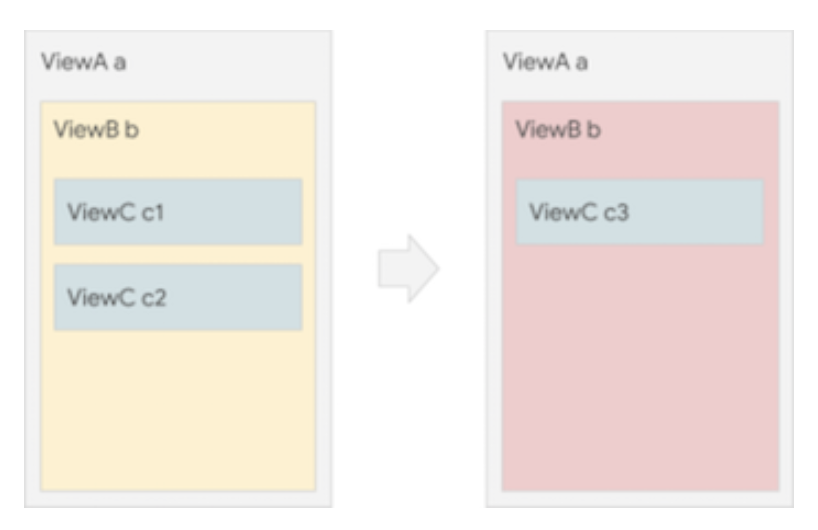

# Declarative UI Basics



**Imperative style**
```
b.setColor(red)
b.clearChildren()
ViewC c3 = new ViewC(...)
b.add(c3)
``` 

**Declarative style**
```
  return ViewB(
    color: red,
    child: ViewC(...),
  )
 ```